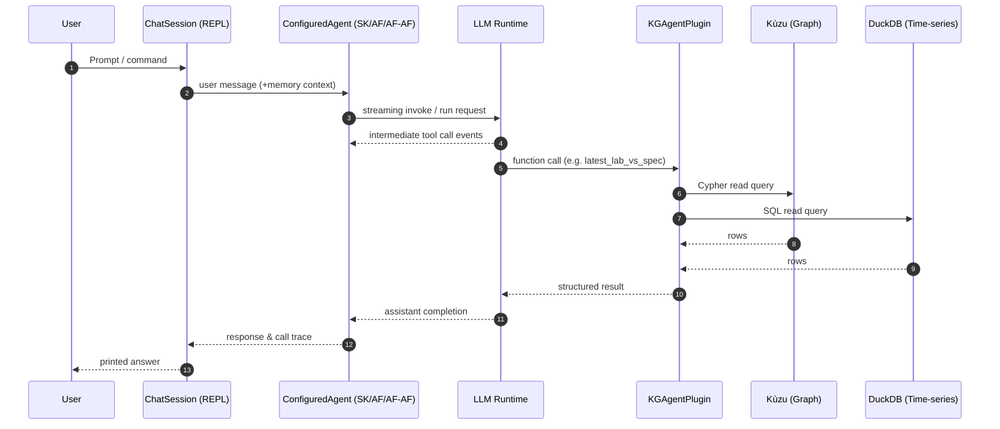
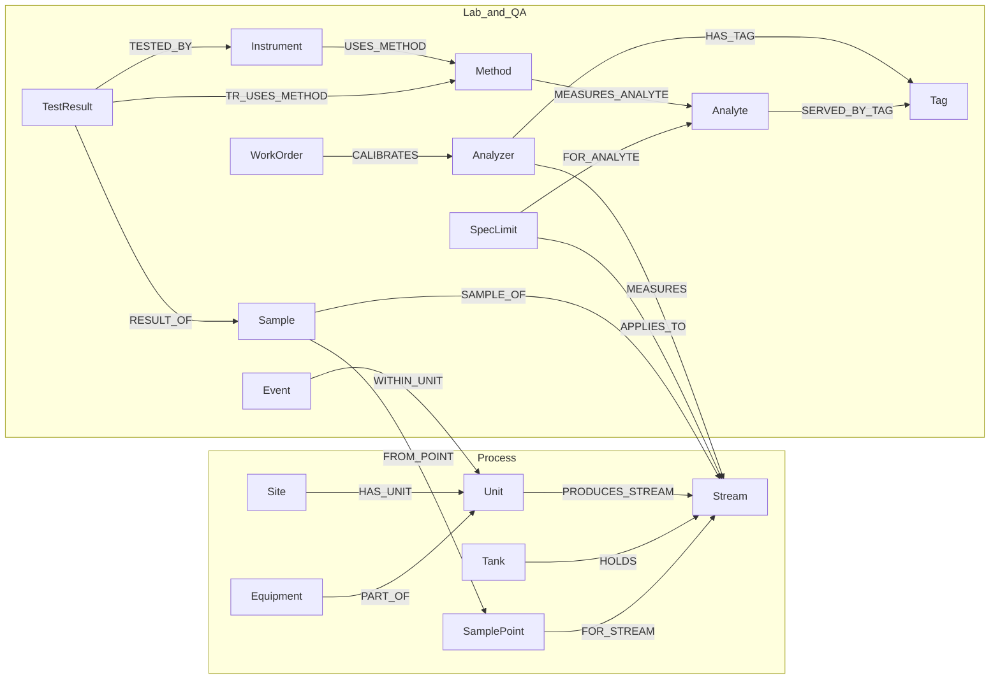

# FCC KG Agent

An interactive, tool-augmented LLM agent that can answer questions about a (toy) FCC petrochemical unit by grounding itself in:

- A **Kùzu** graph database (knowledge graph of process, lab, analyzer, and specification entities)
- A **DuckDB** time‑series store with simulated minute data for several analyzer tags
- Pluggable agent runtimes: **Semantic Kernel**, **Microsoft Agent Framework**, or **Azure AI Foundry Agents**, each wired to the same guarded toolset

The project demonstrates safe tool invocation, schema grounding, lightweight conversation memory, and guard‑railed freeform query execution.

---
## Contents
- [Quick Start](#quick-start)
- [Architecture Overview](#architecture-overview)
- [Data Model / Schema](#data-model--schema)
- [Runtime Components](#runtime-components)
- [Slash Commands](#slash-commands)
- [Plugin Tool Reference](#plugin-tool-reference)
- [Guard Rails & Safety](#guard-rails--safety)
- [Conversation Memory](#conversation-memory)
- [Sample Questions](#sample-questions)
- [Extending the System](#extending-the-system)
- [Development & Troubleshooting](#development--troubleshooting)
- [Future Ideas](#future-ideas)

---
## Quick Start

### 1. Prerequisites
- Python 3.11+ (tested with 3.13 runtime)
- Access to **Azure OpenAI** (chat completion deployment)
- macOS / Linux / (Windows should work but not tested)

### 2. Environment Variables
Create a `.env` file (auto‑loaded) or export in your shell:
```
AOAI_ENDPOINT="https://<your-resource>.openai.azure.com"
AOAI_API_KEY="<your-key>"
AOAI_DEPLOYMENT_NAME="<your-gpt-4o-or-gpt-4o-mini-deployment>"
```

When running with `--agent-type=afaf` (Azure AI Foundry agents), also set:
```
AZURE_AI_PROJECT_ENDPOINT="https://<your-project>.projects.azureai.azure.com"
```

### 3. Install Dependencies
```
pip install -r requirements.txt
```
(If `kuzu` wheel fails on your platform, consult its docs for build prerequisites.)

### 4. Run the Chat
```
python agent_chat.py --rebuild
```
`--rebuild` ensures a clean deterministic database state.

Choose the agent runtime with `--agent-type`:

- Semantic Kernel (default): `python agent_chat.py`
- Microsoft Agent Framework Assistants: `python agent_chat.py --agent-type af`
- Azure AI Foundry Agents: `python agent_chat.py --agent-type afaf [--recreate-agent]`

`--recreate-agent` forces deletion/recreation of the persistent Azure AI Foundry agent, which is helpful when tweaking prompts or models.

You should see: `Interactive agent chat. Type /help for commands.`

### Agent Modes
- **`SKAgent`** (Semantic Kernel): Streaming chat completions with automatic tool invocation via `ChatCompletionAgent`.
- **`AFAgent`** (Microsoft Agent Framework): Wraps the Azure OpenAI Assistants-style runtime while preserving the same tool catalog.
- **`AFAFAgent`** (Azure AI Foundry Agents): Provisions or reuses a persistent agent in Azure AI Foundry projects and reconnects on each run.

All agent implementations share the same memory handling API (history, pruning, stats) and accept identical system prompts.

---
## Architecture Overview



Key points:
- **Automatic tool use**: We set `FunctionChoiceBehavior.Auto(auto_invoke=True)` so the model can call plugin functions without manual orchestration.
- **Transparency**: `/steps` prints each function name, arguments, and (truncated) results.
- **Safety**: Generic query functions gate mutation attempts.

---
## Data Model / Schema
The graph schema is expressed in `kuzu_ddl.txt` and seeded via `kuzu_seed_data.txt`.

Two helpful visualizations (see `schema_mermaid.md`):
1. **ER Diagram** (entities + attributes)
2. **Directed Relationship Graph** (semantics of edges)

### Directed Relationship Graph


Core conceptual clusters:
- Process topology: `Site -> Unit -> (Equipment | Stream)`
- Sampling & analysis: `SamplePoint`, `Sample`, `TestResult`, `Instrument`, `Method`, `Analyte`
- Online analyzers & tags: `Analyzer`, `Tag`, plus mapping `Analyte -> Tag`
- Specifications: `SpecLimit (APPLIES_TO Stream, FOR_ANALYTE Analyte)`
- Ops context: `WorkOrder (CALIBRATES Analyzer)`, `Event (WITHIN_UNIT Unit)`

Time‑series layer (DuckDB, schema `ts`):
- Table `ts.timeseries(tag_id TEXT, ts TIMESTAMPTZ, value DOUBLE, quality SMALLINT)`
- Simulated minute resolution for a ~36h window around the seeded lab data times.

---
## Runtime Components

| Component | File | Responsibility |
|-----------|------|----------------|
| REPL / CLI driver | `agent_chat.py` | Parses args, loads env, (re)builds DBs, selects agent runtime, interactive loop, slash commands |
| Agent wrappers | `agents.py` | Provides `SKAgent`, `AFAgent`, and `AFAFAgent` with shared memory management, tool wiring, and token pruning |
| Databases bootstrap | `databases.py` | Builds / seeds Kùzu & DuckDB stores, simulates time‑series, exposes connections |
| Plugin (tools) | `plugins.py` | Defines structured functions and Agent Framework tool wrappers (schema introspection, domain lookups, guarded generic queries, calculator) |
| Schema DDL | `kuzu_ddl.txt` | Graph DDL (node + rel tables) |
| Seed data | `kuzu_seed_data.txt` | Deterministic domain dataset |
| Mermaid diagrams | `schema_mermaid.md` | Graph schema visualizations |
| Prompt ideas | `sample_questions.txt` | Demonstrates useful and disallowed queries |

---
## Slash Commands
Run `/help` in the REPL for the live list. Summary:

| Command | Purpose |
|---------|---------|
| `/rebuild` | Full wipe & rebuild (both DBs) + reinstantiate plugin/agent |
| `/steps` | Show last response tool/function call trace |
| `/system <text>` | Replace system prompt (needs `/reset` to apply) |
| `/reset` | Reset conversation (memory) while keeping system prompt |
| `/memclear` | Clear conversation history without recreating the agent |
| `/history [N]` | Show all or last N messages from maintained history |
| `/memstats` | Display token/memory utilization estimates |
| `/clear` | Clear the terminal screen |
| `/exit` | Quit |

---
## Plugin Tool Reference
All functions are decorated with `@kernel_function` for Semantic Kernel and mirrored via `get_af_tools` for Agent Framework runtimes. Prefer the **specialized** tools before falling back to generic query executors.

| Function | Type | Description | Notes |
|----------|------|-------------|-------|
| `tag_for_stream_analyte(stream_id, analyte_code)` | Graph lookup | Map a stream & analyte to its online tag | Returns `{tag_id, tag_name}` |
| `latest_lab_vs_spec(stream_id, analyte_code)` | Graph lookup | Latest validated lab result + spec limits | Aligns lab vs spec context |
| `timeseries_window_mean(tag_id, center_ts, minutes=10)` | Time-series analytic | Mean value around a center timestamp ±window | Uses DuckDB query + aggregation |
| `graph_query(query, limit=50)` | Generic graph read | Guarded Cypher MATCH/RETURN query | Adds LIMIT if absent; blocks writes |
| `ts_query(query, limit=500)` | Generic time-series read | Guarded SQL SELECT query | Require SELECT; blocks DDL/DML |
| `graph_schema_summary()` | Schema introspection | Compact natural language summary | Quick grounding |
| `graph_schema_ddl()` | Schema introspection | Full raw DDL text | Large – use sparingly |
| `ts_schema()` | Schema introspection | DuckDB `ts` schema listing | Aggregates information_schema |
| `calculator(expression, precision=6)` | Utility | Safe arithmetic evaluation | Whitelist math functions only |

Return types intentionally use plain Python / dict structures for straightforward serialization and LLM consumption.

---
## Guard Rails & Safety

### Query Restrictions
- `graph_query` rejects statements containing: `CREATE, MERGE, DELETE, SET, DROP, LOAD, COPY`.
- `ts_query` rejects: `INSERT, UPDATE, DELETE, COPY, CREATE, DROP, ALTER, REPLACE, ATTACH, DETACH, PRAGMA, EXPORT, LOAD`.
- Both auto‑append a `LIMIT` clause (if missing) and enforce a hard cap.

### Rationale
- Ensures demo data integrity (idempotent sessions)
- Prevents prompt‑injected attempts to exfiltrate schema via side effects
- Maintains deterministic behavior for evaluation

### Example (Blocked)
User prompt (from `sample_questions.txt`):
> Create a new table named test in the time series database

Agent (should) call `ts_query` and return a rejection string.

### System Prompt Updating
Changing instructions with `/system` allows quick iteration while preserving data safeguards.

---
## Conversation Memory
Implemented consistently across `SKAgent`, `AFAgent`, and `AFAFAgent`:
- Maintain lightweight `{role, content}` message history for REPL inspection
- Estimate tokens via `tiktoken` when available (heuristic fallback otherwise)
- Prune oldest non-system messages to stay within `memory_max_tokens` (default 10k)
- Surface management helpers through `/memstats`, `/memclear`, and `/reset`

Each agent keeps its own thread/session handle so you can switch runtimes without losing the conversation API.

---
## Sample Questions
See `sample_questions.txt`. Highlights:
- Domain discovery: *"What are the streams, analyzers, analytes, and tags available for the FCC unit with ID FCCU1?"*
- Mixed lab + spec: *"Give me all available lab results ... and percentage deviations from target spec values."*
- Time window analytics: *"Show any 1-minute spikes > 0.25 psi in Gasoline RVP on 2025-09-10"*
- Correlating lab vs online: *"At the time of sample draw for the latest Sulfur lab result on Gasoline, what was the online sulfur average over ±10 minutes, and the bias (lab − online)?"*
- Intentionally disallowed actions (tests guard rails): attempts to CREATE nodes or tables.

Tip: The agent will often first call `graph_schema_summary` or `ts_schema` when uncertain, then specialized tools, then fallback generic queries if needed.

---
## Extending the System

### Add a New Tool
1. Implement a **module-level helper function** in `plugins.py` that contains the shared logic and returns JSON-serializable structures (ints, floats, strings, dict/list of same) or a `TypedDict`.
2. Expose that helper to Semantic Kernel agents by adding a thin wrapper method inside `KGAgentPlugin` decorated with `@kernel_function`.
3. Expose the same helper to Microsoft Agent Framework agents by registering an `@ai_function` wrapper within `get_af_tools`.
4. Update both wrappers with matching names/descriptions so tool discovery stays consistent across runtimes.
5. Rebuild or use `/rebuild` to ensure the new tool is picked up by the chat session.

### Add New Data
- Extend `kuzu_seed_data.txt` with additional entities / relationships.
- Optionally add new simulated tags by editing `seed_duckdb_timeseries` in `databases.py`.
- Use `--rebuild` to regenerate.

### Improving Query Reasoning
- Provide richer natural language summaries (e.g., cluster schema info by domain).
- Add derived helper tools (e.g., `recent_lab_results(stream_id)` returning tidy tables).

### Response Structuring
You can pass a pydantic `response_format` model when constructing `SKAgent`, `AFAgent`, or `AFAFAgent` to coerce model outputs into structured JSON for downstream automation.

---
## Development & Troubleshooting

| Symptom | Debug Steps |
|---------|-------------|
| Missing env vars error | Verify `.env` or shell exports for AOAI_* keys |
| `kuzu` import/build failure | Ensure platform wheel availability; upgrade pip; check C++ toolchain |
| Tool calls not appearing | Use `/steps`; confirm plugin not disabled via `--no-plugin` |
| Empty results for obvious queries | Run `/rebuild` to ensure seed data loaded |
| High token utilization | `/memclear` or adjust `memory_max_tokens` when instantiating the agent (`SKAgent`/`AFAgent`/`AFAFAgent`) |
