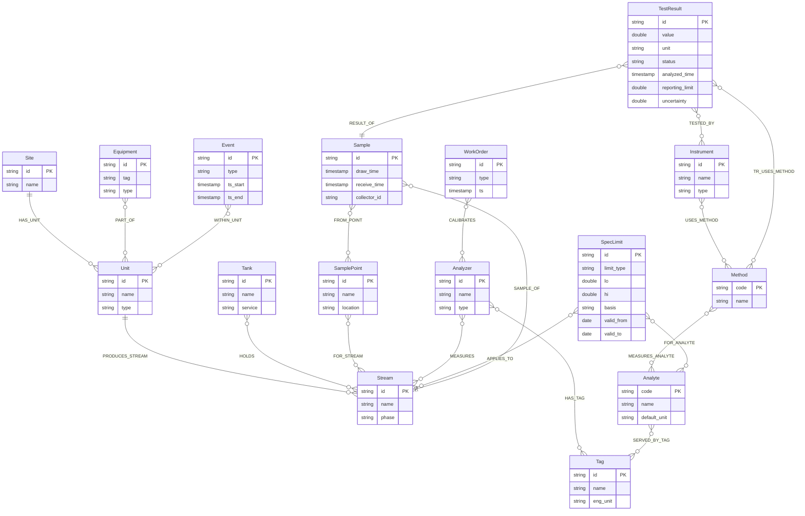

# Knowledge Graph Schema (Mermaid)

Below are two Mermaid diagrams:
1. ER-style entity definitions with attributes.
2. Relationship / topology diagram showing directed edges (FROM -> TO as defined in the DDL).

---
## 1. ER Diagram

---
## 2. Directed Relationship Graph

---
### Notes
- Cardinalities are shown generically; adjust (e.g., ||--o{) if you add explicit constraints later.
- Some semantic assumptions (e.g., many-to-many) are made due to absence of explicit constraint metadata in the DDL.
- Feel free to tweak clustering or styling depending on your presentation needs.

### Next Steps / Optional Enhancements
- Add cardinality annotations if domain rules are known (e.g., a Sample belongs to exactly one Stream).
- Generate automated Mermaid from DDL via a small parser script if schema evolves frequently.
- Produce temporal lineage views (Sample -> TestResult) filtered by time windows.
